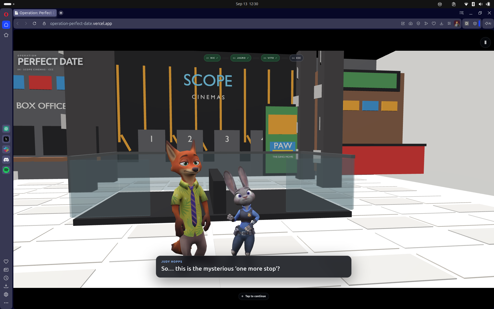
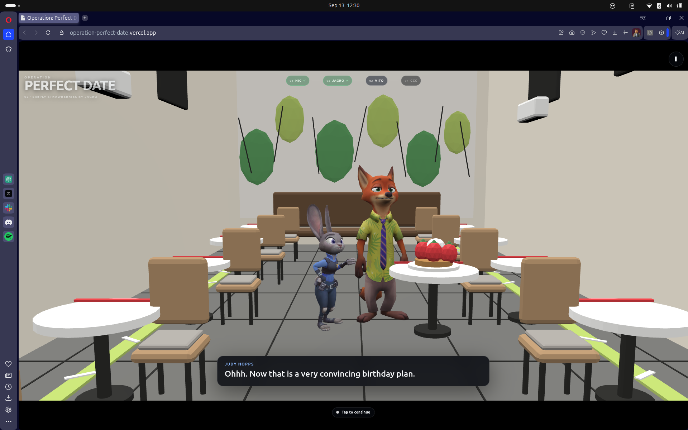
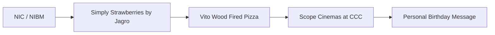
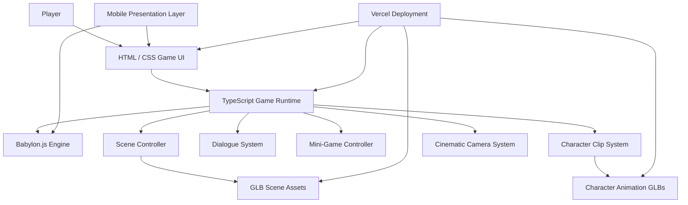
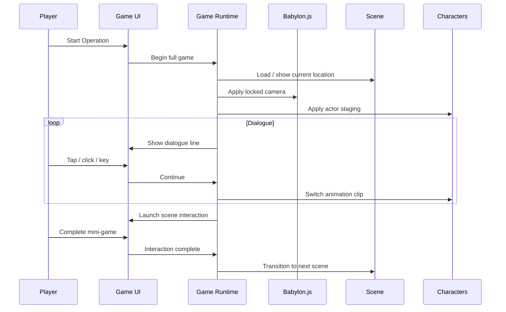

# Operation: Perfect Date


A custom interactive 3D birthday experience built as a cinematic mini-game using Babylon.js, TypeScript, Vite, Blender-created assets, character animation, mobile-first interaction, and a four-scene story flow.

The experience follows a complete birthday-date journey through:

* NIC / NIBM
* Simply Strawberries by Jagro
* Vito Wood Fired Pizza
* Scope Cinemas at Colombo City Centre
* a final personal birthday message

Unlike a standard greeting page, this project combines scripted dialogue, animated 3D scenes, cinematic camera staging, scene transitions, mini-games, responsive mobile controls, fullscreen presentation, and a personalized finale.

Built and engineered by **Navodhya Fernando**.

> This is a private, fan-made, non-commercial personal project.  
> Third-party characters, names, trademarks, film titles, and related intellectual property remain the property of their respective owners.

---

## Preview

### Scope Cinemas — Final Scene



### Simply Strawberries by Jagro



---

## What This Project Does

Operation: Perfect Date turns a birthday message into a short interactive story game.

The player moves through four themed 3D locations while following a scripted story featuring Nick and Judy-inspired characters, location-specific dialogue, cinematic camera staging, interactive mini-games, and a final personalized birthday message.

The project is intentionally structured more like a small mobile game than a traditional website.

It combines:

* scene-by-scene cinematic storytelling,
* animated 3D characters,
* interactive dialogue progression,
* location-specific mini-games,
* mobile landscape optimization,
* fullscreen / immersive presentation,
* fixed cinematic cameras,
* responsive 16:9 framing,
* Retina-aware WebGL rendering,
* pause, restart, and replay controls,
* and a final personalized birthday card.

---

## Story Flow



### Scene 01 — NIC / NIBM

The experience begins as a mission briefing.

The player is introduced to the birthday mission and progresses through the opening Nick and Judy dialogue before accepting the mission.

### Scene 02 — Simply Strawberries by Jagro

The story moves into a lighter birthday reward scene centered around Jagro's signature desserts.

The location includes a short interactive challenge before continuing the story.

### Scene 03 — Vito Wood Fired Pizza

The third stop shifts into a playful pizza scene.

The experience includes an interactive pizza-building mini-game and continues the running mission dialogue.

### Scene 04 — Scope Cinemas at CCC

The final story location reveals the last stop at Scope Cinemas in Colombo City Centre.

The PAW Patrol: The Dino Movie reveal acts as the final mission payoff before transitioning into the personal birthday message.

### Finale

The game ends with a custom birthday message written specifically for the recipient and a final:

```text
MISSION COMPLETE ✓
```

---

## Features

* **Four Fully Staged 3D Scenes:** NIC, Jagro, Vito, and Scope Cinemas at CCC.
* **Animated Character System:** Supports multiple self-contained animation clips for Nick and Judy.
* **Scripted Dialogue Engine:** Tap, click, Space, or Enter progresses dialogue.
* **Scene-Specific Cameras:** Each location uses a locked cinematic camera composition.
* **Interactive Mini-Games:** Small gameplay moments are placed between story beats.
* **Mission Progress HUD:** Tracks progress across all four locations.
* **Mobile Landscape Mode:** Designed primarily for landscape phone gameplay.
* **16:9 Immersive Presentation:** Keeps the game framed like a mobile cinematic experience.
* **Fullscreen Support:** Includes a dedicated fullscreen control and mobile immersive mode handling.
* **iOS-Friendly Start Flow:** Prevents portrait-mode blocking before the user can start.
* **Retina-Aware Rendering:** Babylon render resolution scales up to a capped 2× device-pixel ratio on mobile.
* **Camera Lock:** Player controls cannot rotate, pan, or zoom the authored cinematic camera in the normal build.
* **Pause / Resume / Restart:** Player-friendly game controls are available throughout the experience.
* **Replay Support:** The complete story can be replayed from the beginning.
* **Debug Editor Mode:** `?editor=1` enables visual staging and development controls without exposing them to normal players.
* **Production Deployment:** Optimized for static deployment through Vercel.

---

## Interactive Gameplay

The project intentionally avoids complex free-roam mechanics.

Instead, gameplay uses short interactions that preserve the pacing of the birthday story.

Current interaction design includes:

| Scene | Interaction |
| --- | --- |
| NIC | Mission acceptance interaction |
| Jagro | Dessert / cheesecake interaction |
| Vito | Pizza-building mini-game |
| CCC | Movie-poster / reveal interaction |

The gameplay loop is intentionally simple:

```text
Dialogue
   ↓
Short Interaction
   ↓
Character Reaction
   ↓
Cinematic Transition
   ↓
Next Location
```

This keeps the experience personal, playable, and lightweight without turning the project into a full navigation-heavy 3D game.

---

## Character Animation System

Character animations are exported as self-contained GLB actors.

Instead of runtime skeleton retargeting, each animation contains its own compatible mesh, skeleton, and animation data.

The runtime switches between complete clip actors under a shared placement root:

```text
Nick_PLACEMENT_ROOT
├── Nick_Idle
├── Nick_Talking
├── Nick_Pointing
├── Nick_Walking
├── Nick_Run_Look_Back
└── Nick_Kiss

Judy_PLACEMENT_ROOT
├── Judy_Idle
├── Judy_Talking
├── Judy_Questioning
├── Judy_Walking
├── Judy_Run
└── Judy_Kiss
```

This approach keeps scene placement stable while avoiding animation retargeting issues.

---

## Rendering and Mobile Optimization

The mobile version uses several optimizations to keep the experience sharp and game-like.

### 16:9 Game Viewport

The game is framed inside a centered 16:9 viewport.

On ultrawide mobile displays, unused space becomes clean letterboxing rather than stretching or cropping the authored camera composition.

### Retina Rendering

On mobile devices, Babylon uses the device pixel ratio up to a maximum of 2×.

Conceptually:

```ts
const dpr = Math.min(window.devicePixelRatio || 1, 2);
engine.setHardwareScalingLevel(1 / dpr);
```

This keeps the 3D scene sharper on high-density displays without forcing expensive 3× rendering on modern iPhones.

### Orientation and Fullscreen

The game:

* requests landscape orientation where supported,
* requests fullscreen after a user gesture,
* resizes Babylon after orientation changes,
* resizes after fullscreen changes,
* reacts to Safari `visualViewport` resizing,
* and provides a fallback message when iOS Safari does not expose true webpage fullscreen.

### Safari Rendering

The mobile presentation avoids transform-forced compositing on the main game viewport where possible to reduce scene softening on Safari.

---

## Cinematic Camera Design

The game does not use free-roam camera controls in normal player mode.

Each location has an authored camera designed around:

* character visibility,
* location identity,
* dialogue readability,
* background storytelling,
* and mobile 16:9 composition.

The normal build disables Babylon camera control so the player cannot accidentally orbit away from the intended scene.

Development camera controls remain available in debug mode.

---

## Debug Editor

The internal visual editor is enabled through:

```text
?editor=1
```

Example:

```text
http://localhost:5175/?editor=1
```

The editor supports:

* selecting Nick and Judy,
* move gizmo,
* rotate gizmo,
* scale gizmo,
* numeric transforms,
* scene staging presets,
* camera staging,
* copying scene configuration,
* and development-only visual debugging.

The normal player build does not expose these controls.

---

## Tech Stack

### Core Runtime

* Babylon.js
* WebGL 2
* TypeScript
* Vite

### 3D Pipeline

* Blender
* GLB / glTF
* Mixamo animation sources
* Blender-based animation cleanup and export pipeline

### Frontend

* HTML
* CSS
* TypeScript
* DOM-based HUD and dialogue UI
* Pointer / touch interaction

### Deployment

* Vercel
* Static Vite production build

### Development Environment

* Ubuntu Linux
* VS Code
* Node.js
* npm
* Chromium-based browsers for WebGL development

---

## System Architecture



---

## Runtime Flow



---

## Repository Structure

```text
babylon_game/
├── index.html
├── package.json
├── package-lock.json
├── README.md
├── LICENSE
├── docs/
│   └── screenshots/
│       ├── scope-cinemas-ccc.png
│       └── jagro-scene.png
├── public/
│   └── assets/
│       ├── locations/
│       ├── characters/
│       ├── animations/
│       ├── audio/
│       ├── posters/
│       └── ui/
└── src/
    ├── main.ts
    └── style.css
```

Development backups and generated build folders should remain excluded from Git.

Recommended `.gitignore` entries:

```gitignore
node_modules/
dist/
.vercel/
_pre_*/
*.log
.DS_Store
```

---

## Quick Start

### Prerequisites

* Node.js 18+
* npm
* Browser with WebGL 2 support

### Install Dependencies

```bash
npm install
```

### Start Development Server

```bash
npm run dev
```

Open the URL shown by Vite, normally:

```text
http://localhost:5173/
```

or the active port assigned by Vite.

### Debug / Editor Mode

```text
http://localhost:5173/?editor=1
```

---

## Production Build

Build the production version:

```bash
npm run build
```

The production output is generated under:

```text
dist/
```

Preview the production build locally:

```bash
npm run preview -- --host
```

---

## Deployment

The project is designed for Vercel deployment.

### Initial Deployment

```bash
npx vercel
```

### Production Deployment

```bash
npx vercel --prod
```

The deployment process detects the Vite project and serves the generated static build.

---

## Player Controls

### Desktop

* **Click:** progress dialogue
* **Space:** progress dialogue
* **Enter:** progress dialogue
* **Esc:** pause / resume
* **Pause button:** open pause menu

### Mobile

* **Tap:** progress dialogue
* **Touch interactions:** complete mini-games
* **Fullscreen button:** enter immersive mode where supported
* **Rotate device:** landscape gameplay
* **Pause button:** pause the experience

The normal game build intentionally has no free camera controls.

---

## Scene Development Workflow

Each scene was built and approved independently before being integrated into the full game.

The development process followed:

```text
Build Location Asset
        ↓
Load into Babylon
        ↓
Stage Characters
        ↓
Lock Camera
        ↓
Approve Dialogue
        ↓
Lock Scene Checkpoint
        ↓
Integrate into Full Game
```

This reduced regressions and made each location independently recoverable during development.

---

## Key Technical Decisions

### Self-Contained Animation GLBs

Animation clips are exported as complete actors rather than relying on runtime retargeting.

This reduces compatibility issues between Blender, Mixamo, glTF, and Babylon skeleton rest poses.

### Fixed Cinematic Cameras

The final player experience uses fixed authored cameras instead of player-controlled orbit cameras.

This ensures the story composition remains consistent across desktop and mobile.

### Static Hosting

No backend is required.

The complete game can be deployed as static files through Vercel.

### Progressive Mobile Enhancements

Fullscreen and orientation APIs are treated as optional browser enhancements.

The project remains usable when Safari or another mobile browser refuses those APIs.

---

## Performance Notes

The project balances visual quality and mobile performance through:

* 2× maximum mobile device-pixel ratio,
* static GLB scene assets,
* scene visibility control,
* fixed camera rendering,
* lightweight DOM UI,
* no server-side runtime,
* mobile-specific layout compression,
* and responsive Babylon engine resizing.

For lower-end devices, the mobile render scale can be reduced by lowering the maximum DPR cap.

---

## Browser Support

Recommended:

* Chrome / Chromium
* Edge
* Opera
* modern Android browsers
* Safari on iPhone / iPad with mobile-specific fallbacks

Some mobile browser capabilities differ:

* fullscreen may require a user gesture,
* screen orientation locking may not be available,
* iOS Safari may prefer Add to Home Screen for the most immersive presentation.

---

## Security and Privacy Notes

* No account system is required.
* No user authentication is required.
* No personal data needs to be submitted by the player.
* No backend database is used by the core game.
* Deployment is static.
* Development/editor tools are hidden from normal player mode.

---

## Project Highlights

This project demonstrates:

* interactive 3D web development,
* Babylon.js scene engineering,
* TypeScript application development,
* Blender-to-web asset workflows,
* Mixamo animation integration,
* animation debugging,
* glTF / GLB pipelines,
* cinematic camera staging,
* responsive game UI design,
* mobile WebGL optimization,
* Retina rendering,
* touch interaction design,
* mini-game implementation,
* browser fullscreen/orientation handling,
* Vite production builds,
* and Vercel deployment.

It demonstrates the ability to take an idea from a personal story concept through 3D asset production, animation, interaction design, frontend engineering, mobile optimization, production testing, and live deployment.

---

## Fan Project and Third-Party IP Notice

This repository may reference or visually depict third-party characters, names, films, businesses, logos, or trademarks solely as part of a private, personal, fan-made, non-commercial birthday project.

No affiliation, sponsorship, endorsement, or ownership of those third-party properties is claimed.

All third-party intellectual property remains the property of its respective owners.

The proprietary license in this repository applies only to original code, original project structure, original written content, and original assets owned by the repository copyright holder. It does not grant or claim rights over third-party intellectual property.

---

## License

This project is proprietary software.

Copyright © 2026 Navodhya Fernando. All Rights Reserved.

No permission is granted to use, copy, modify, distribute, sublicense, publish, sell, commercialize, or create derivative works from the original portions of this project without prior written authorization from the copyright owner.

See [`LICENSE`](LICENSE) for the complete terms.
